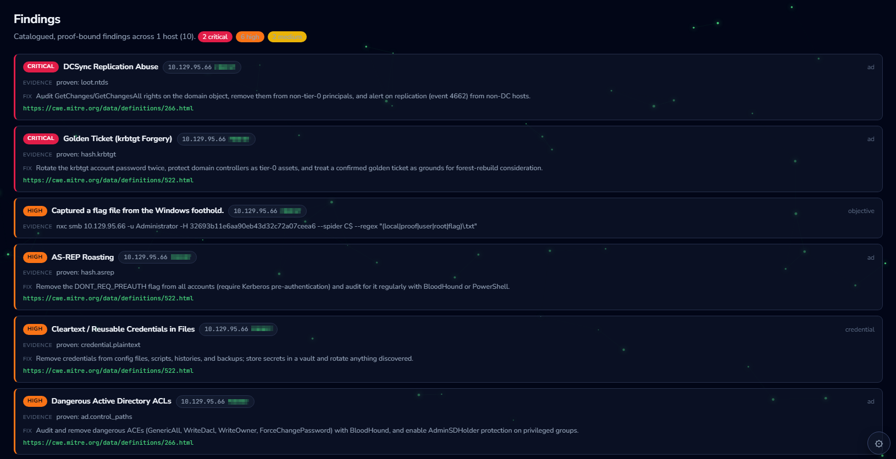
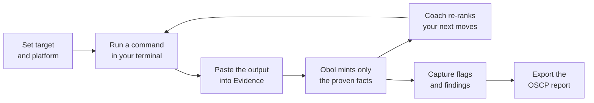
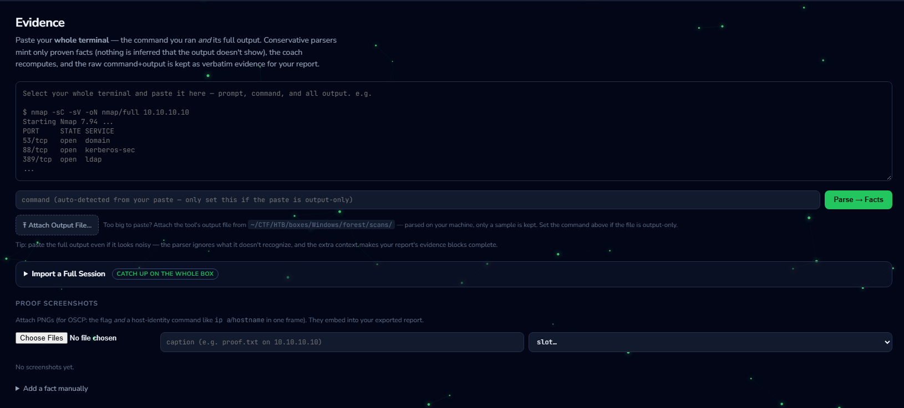
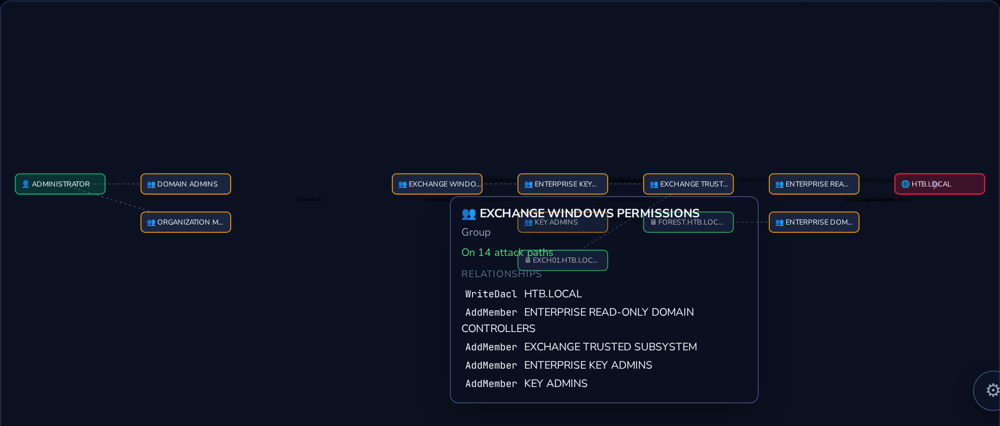
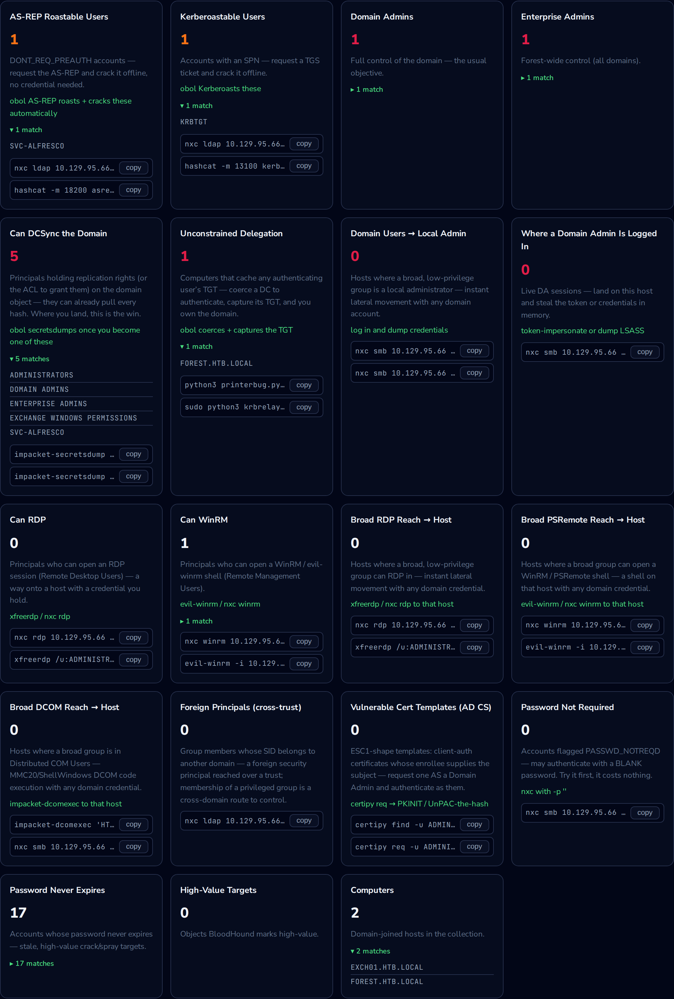
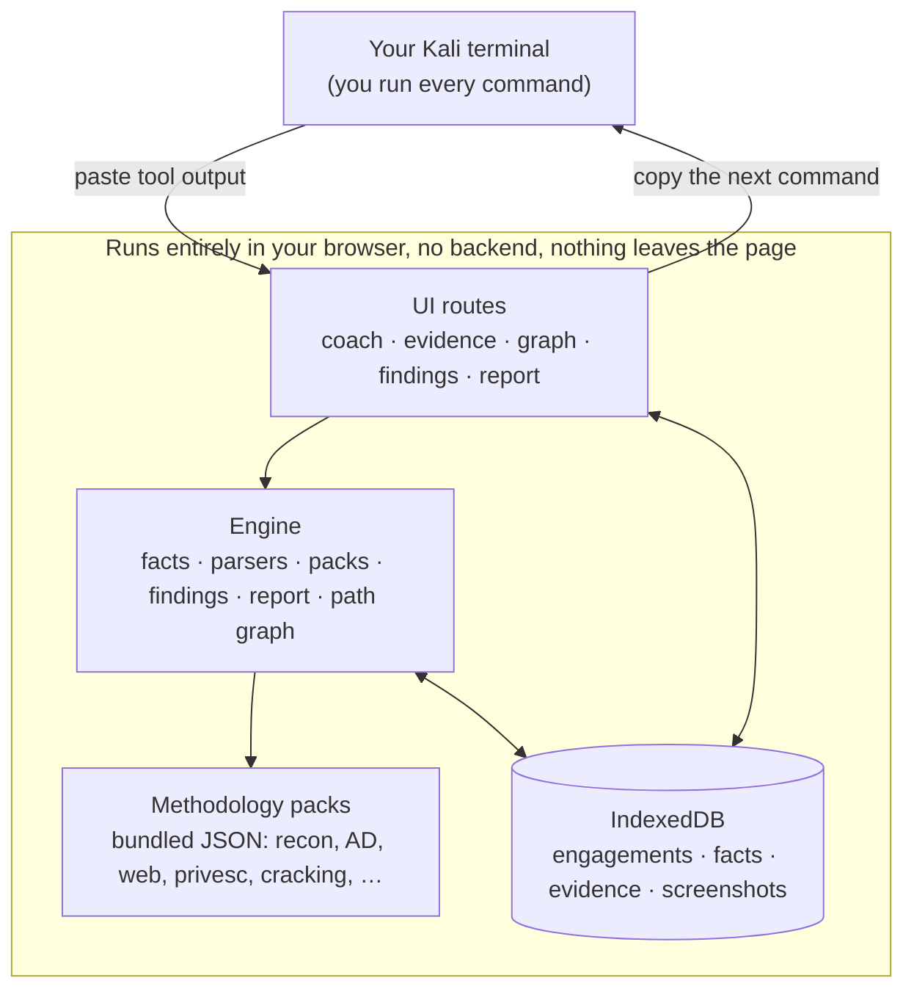

# Obol: your OSCP prep companion in the browser

**Obol is a free, browser-based sidekick for hacking practice boxes and exams.** You still do
the hacking in your own terminal. Obol is the calm voice next to you that says *"here's the
next command to try, and here's why,"* keeps track of what you've actually proven about a box,
and quietly assembles your report as you go.

  

No install. No login. No backend. Nothing you type ever leaves your browser. Open the page and
start.

**Live site: https://platocres.github.io/obol/**

---

## What to expect

Studying for the OSCP (or grinding HTB / TryHackMe) is really an exercise in *not getting
lost*: you're staring at an open port wondering what to run, forgetting which creds worked where,
and panicking about screenshots the night before the exam. Obol takes that load off you:

- **Tells you what to do next.** Instead of a giant cheatsheet, Obol looks at what you've proven
  about a target so far and gives you a short, ranked list of the *next* commands worth running,
  each ready to copy, with a one-line "why" and an honest note on what it does **not** prove.
- **Keeps you honest.** Obol only marks something as true when your tool output actually shows it.
  An open port is not a shell. A crackable hash is not a login. This is exactly the discipline the
  exam graders (and good pentesters) expect.
- **Remembers everything.** Which hosts are up, which services are open, which creds are valid where,
  what you've already tried, all tracked so you don't re-scan the same box at 3am.
- **Shows you the whole path.** A pan-and-zoom attack-path graph lays out what you've proven and what
  each next move would unlock, with hover cards that explain each step and hand you the command.
- **Writes your report.** As you capture flags and findings, Obol assembles an OSCP-style report and
  exports it as Markdown, HTML, PDF, or Word, with the proof discipline and redaction the exam
  requires.
- **Runs entirely on your machine.** It's a static web page. Your targets, creds, and notes live in
  your browser only. You can even save the page and use it offline.

> Obol **never runs commands for you.** It builds them so *you* can review and run them in an
> authorized lab or exam. That's on purpose: you stay in control, and every command lands in your
> own terminal history as evidence.

---

## A look inside

**The coach (the site's "Next Steps" tab): your ranked, copy-ready next moves**

  

**Proof-gated: Obol only records what your output actually shows**

  

**Everything tracked: hosts, services, credentials, and domain**

  

**Findings: catalogued and proof-bound, grouped by severity or target**

  

<table>
  <tr>
    <td width="50%" valign="top" align="center">
      <b>The attack-path graph</b>  
      
    </td>
    <td width="50%" valign="top" align="center">
      <b>OSCP report export</b>  
      
    </td>
  </tr>
</table>

---

## How it works

Obol watches one thing: **proof**. You run a command, paste the output, and Obol's parsers mint
*facts*, but only for what the output genuinely demonstrates. Those facts drive everything else:
the next-move coach (the **Next Steps** tab), the attack-path graph, the findings list, and the
report all recompute the instant a new fact lands. Nothing is asserted without evidence, and
nothing is executed for you.

The loop is deliberately tight: **run, paste, get the next move**, over and over, until the box
is rooted. Findings and flags accumulate as you go, so the report is essentially finished the
moment you are.

**Feeding Obol: paste your whole terminal, and only the proven facts are minted.**

  

---

## A quick walkthrough

1. **Start an engagement.** On the **Engagements** screen, pick the platform you're working on:
   HTB, OffSec/OSCP, OffSec Labs (PWK), TryHackMe, HTB CPTS, CTF, or OSWP. Your choice tunes Obol
   to that platform's flags, proof rules, and report style. Paste your target IP(s) (junk and CIDR
   ranges are filtered automatically) and select **Create & launch**.
2. **Get your first move.** You land on **Next Steps**, the coach. For a fresh box it suggests an
   nmap scan first. Select **copy**, paste it into *your* terminal, and run it.
3. **Feed Obol what you found.** Copy your tool's output and paste it into **Evidence**. The parsers
   read it and record only what is actually proven: open ports, reachable services, a valid
   credential. Nothing is invented.
4. **Watch the path open up.** Next Steps recomputes instantly, and new moves unlock (found LDAP?
   the Active Directory moves appear). Blocked moves are listed too, each naming the exact fact that
   would unlock it, so you always know what to hunt for next.
5. **Repeat until rooted.** Along the way: build a specific command with every flag on the **Tools**
   tab; open a box's own attack-path page from **Targets**; drop a SharpHound zip on **Domain** for
   instant attack-path analysis; and track where each credential works on **Creds**.
6. **Capture flags and report.** The **Scoreboard** tracks your local/root flags and OSCP points.
   When you're done, **Report** exports an OSCP-style writeup (secrets redacted by default).

---

## The tabs, in plain terms

| Tab | What it's for |
|---|---|
| **Engagements** | Start/switch a run; pick your platform; set your scope. |
| **Targets** | Your boxes. Select one for its personal attack-path page. |
| **Evidence** | Paste tool output here and Obol turns it into proven facts. Also attach **proof screenshots** that embed into your report. |
| **Next Steps** | The coach: your ranked, copy-ready next commands. |
| **Playbooks** | Ready-made command sequences (for example, AD recon) for common flows. |
| **Tools** | Build a specific tool's command with every flag, presets, and your values filled in. |
| **Map** | The whole engagement at a glance: hosts, services, creds, domain. |
| **Domain** | Upload a SharpHound zip to see who is Kerberoastable, paths to Domain Admin, and a printable report. |
| **Creds** | Which credential works on which host; one-click retarget. |
| **Checklist** | The full methodology, tickable, so nothing gets missed. |
| **Findings** | Every catalogued finding across all your hosts, grouped by severity or by target, each with a remediation. |
| **Scoreboard** | Flags captured and OSCP points vs. the pass threshold. |
| **Report** | Your exportable OSCP/CTF report, with proof discipline and redaction. |

**Pro tip:** press **⌘K / Ctrl+K** anywhere to fuzzy-search every command; Enter copies it with
your target and creds already filled in. A skin picker in the settings menu (bottom-right) lets you set
the console green, amber, or several other themes.

---

## The attack-path graph

The **Next Steps** and per-target pages render a live attack-path graph, projected from your facts
and the methodology packs:

- **Nodes are named for techniques**, not raw fact keys: a milestone reads *DCSync Replication
  Abuse*, not `loot.ntds`.
- **A colour legend doubles as filters.** Each of the five node states (do-next, proven, done,
  pending goal, blocked) is a toggle; click one to hide that category and focus the view.
- **Hover any node** for a card explaining what it is, why it matters, and the exact command to run,
  with a one-click copy button.
- **Pan, zoom, and fit** for large domains, and toggle the whole methodology on to see every branch.

---

## BloodHound domain analysis

Drop a SharpHound `.zip` (or BloodHound-CE `.json` files) on the **Domain** tab and Obol parses the
whole collection in your browser, with nothing uploaded anywhere. From that one export it does two
things a raw BloodHound dump does not.

First, it derives and draws the **owned-to-Domain-Admin attack paths** as an interactive graph you
can pan, zoom, and rearrange. Hover any node for a card that gives you the full name (even when the
label is truncated on the canvas), what the object is, how many paths run through it, and the exact
edges it can abuse, so a chain like *Exchange Windows Permissions holds WriteDacl over the domain*
reads at a glance.

  

Second, it answers a board of **PlumHound-style high-value queries** from the same data: who can
DCSync, who is Kerberoastable or AS-REP roastable, unconstrained delegation, local-admin and shell
reach, vulnerable certificate templates, blank-password accounts, and more. Each card shows the
count, expands to the exact principals behind it, and hands you copy-ready commands pre-filled with
your target (and your credentials when you hold them).

  

---

## A note for exam day

Obol models the OSCP scoring rules: local + proof flags per machine, the 70-point pass threshold,
and the Active-Directory set's all-or-nothing block. It also reminds you when a flag needs a
**compliant proof screenshot** (the flag *and* `ip a` / `hostname` in the same window), which is the
most common way students lose points they earned. Obol can't take the screenshot for you, but it
won't let you forget it, and it gives you a one-click slot to attach it to the right flag.

Everything is browser-local, so keep the tab open (or save the page) during your exam. Nothing is
sent anywhere.

---

## Architecture

Obol is a **static single-page app**: plain HTML, CSS, and vanilla JavaScript, with no framework,
no build step, and no server. Modules attach to a single global namespace and are loaded directly
by the browser. The engine (facts, parsers, methodology packs, findings, report, and path graph) is
pure and UI-independent; the UI routes are thin views over it. All state lives in your browser's
IndexedDB, so an engagement survives a refresh and never leaves the machine.

**Design principles**

- **Proof-gated.** Facts are only minted from real tool output; the coach, graph, findings, and
  report are all projections of that fact ledger.
- **No execution, no telemetry.** Obol builds commands for you to run; it never runs them, and it
  makes no network calls.
- **Offline-first.** Everything is client-side, so the app works from `file://` and keeps running
  with no connection.

---

## Run it yourself

Open `index.html` in any modern browser: no server, no build step, no dependencies. It works
offline. To host your own copy, drop the folder on any static host (GitHub Pages, Netlify, or even
`file://`). Your engagement data is stored in your browser's local database (IndexedDB); clearing
site data resets it, and different browsers or devices keep separate copies.

Tests live in `tests/` (a pure-Node engine suite and a headless-browser smoke of the real app).

---

## Status and direction

Obol is under active development, a growing companion rather than a finished product. The methodology
packs, parsers, and coaching keep improving, and you should expect the occasional rough edge in the
meantime.

One thing won't change: **Obol will never pwn a box for you.** It doesn't run exploits, and it can't
guarantee an end-to-end path to root on every machine, by design. It's a coach that keeps you
oriented, honest, and organized while *you* do the hacking, which is exactly the skill the OSCP is
testing. Where Obol doesn't yet have a move for some niche service or unusual chain, it won't invent
one; it points you at the next reasonable step and stays out of your way.

The long-term goal is to map **every attribute of a quality penetration test** into Obol's workflow:
disciplined enumeration, proof-gated findings, the full attack-path methodology, credential and pivot
tracking, and exam-grade reporting, so that working a box in Obol mirrors how a strong operator
actually thinks and documents. That target keeps expanding, and the tool grows toward it with every
engagement.

---

## Legal and ethics

Obol is for **authorized** labs, training, CTFs, exam preparation, and engagements where you have
explicit permission to test. Don't point it at anything you're not allowed to touch.

## License

Copyright (C) 2026 platocres.

Obol is free software, released under the [GNU Affero General Public License v3.0](LICENSE). You may
use, study, modify, and share it under those terms; any distributed or network-served derivative must
remain open under the same license. See [CONTRIBUTING.md](CONTRIBUTING.md) for how contributions are
licensed.
